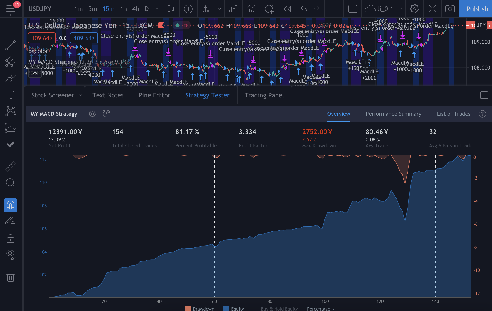

# My strategies and indicators Tradingview Pine Code
<!-- My strategies and indicators. -->

I had used this to predict the FX, but I did not follow it.
In the end, this strategy looks much better than what I did. 

## MY MACD Strategy

You can check the my [source code here](MY_MACD_Strategy.pine).

This figure shows a result of this strategy.

Let hist is macd - sma.
The basic idea is to buy or sell when hist crossover 0 and to close when hist not increase or decrease.
For this strategy, we need decide long or short at first, then the our code will help to find entry and close points.

** Note that this strategy may increase lot when you lose, which is not completely safe.

### Parameters

- MACD parameters
    - fast_length = 12
    - slow_length = 26
    - signal_smooth = 9
- delay = 3: to determine close points when not increase after 3 time units.
- src = close: source price.

- Check box for single
    - Simple MA (Oscillator)
    - Simple MA (Single line)
- Check box for buy or sell (Only one should be check)
    - ifsell
    - ifbuy

- lot: initial lot
- Safeline = 0: you can increase this value like 0.5 or 1 to start a position with more confidence.
